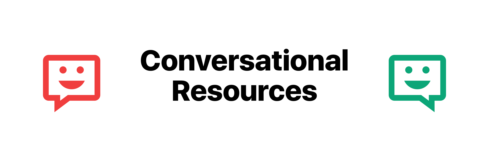

# VoiceFirst Reading List

A reading list for conversational voice interface designers.

**Note:** if you want to add yours, just send a pull request. 👋

### Directories
- [CUI Tools](https://cui.tools) > Best Tools & Resources for Conversational AI Design Projects

### Jobs
- [CT Job Board](https://cui.tools/job-board/) > Find jobs in conversational AI

### Books
- 

### Articles
- [UI of the Future: The Basic Principles of Conversational User Interfaces](https://www.shopify.com/partners/blog/conversational-user-interfaces) > Good list of steps and description of elements involved
- [How to write dialogue for Conversational UI](http://hvdam.com/dialogue-for-conversational-ui/) > Tips on writing dialog 

### Tutorials

### Videos

### Podcasts
- [Voice Tech Podcast](https://voicetechpodcast.com)
